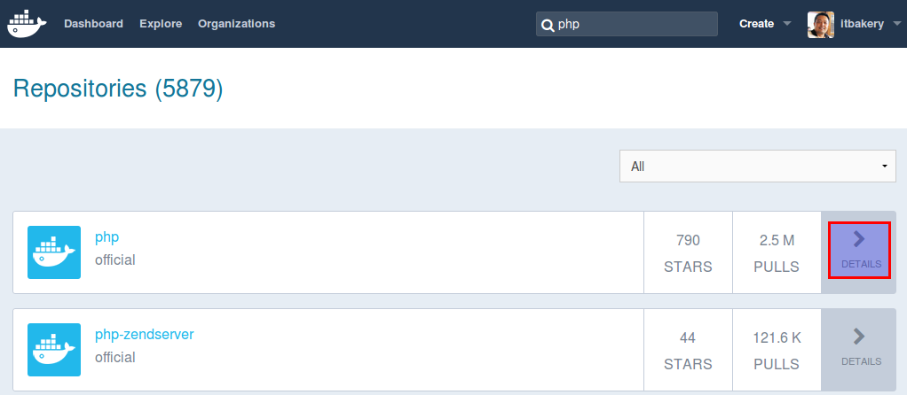
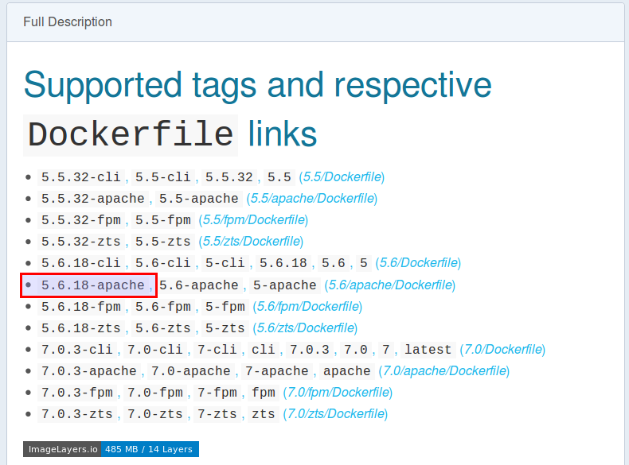
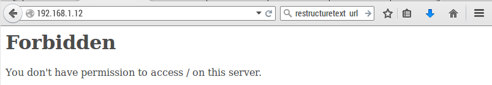
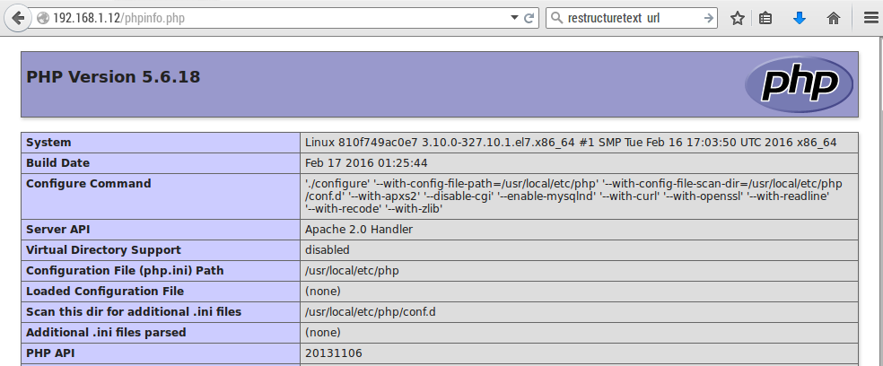
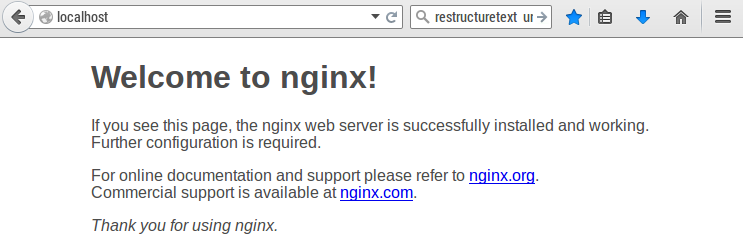
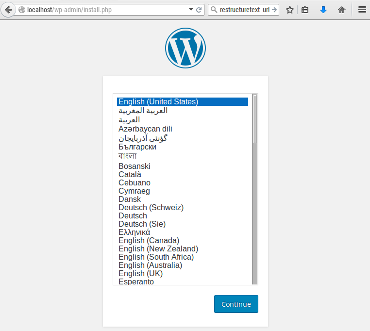

บทที่ 2 Docker Container
########################

Docker container เป็นเทคโนโลยี ที่อยู่พื้นฐานของ Linux Container มีวัตถุประสงค์ที่ต้องการสร้าง
สถาพแวดล้อมให้แก่ app หลายๆ app (Apache, PHP, MySQL, Wordpress..) ออกจากกัน
การแยกออกจากกันนี้ (Isolation) โดยจะอาศัย ความสามารถของ  Linux kernel  ที่เรียกว่า
namespace  ความสามารถในการทำ isolation นี้ที่ผ่านมาเราใช้ความสามารถของการสร้าง
virtual machine แต่มีข้อเสียดังนี้

1. ใช้เวลาในการ Boot time นาน เนื่องจากจะต้องเริ่มต้นการทำงานจาก การ boot guest os
2. เสีย Overhead เพื่อใช้ในสร้าง guest os
3. มีขนาด image ใหญ่

แต่ตรงกันข้ามกับ Docker ที่ใช้ความสามารถของ Container จะมีขนาดเล็กและเร็วกว่า

.. image:: /_images/docker-containers-vms.png

ติดตั้ง Docker
**************

1. เพิ่มเติม Docker repo

.. code-block:: bash
    :linenos:

    $ sudo tee /etc/yum.repos.d/docker.repo <<-'EOF'
    [dockerrepo]
    name=Docker Repository
    baseurl=https://yum.dockerproject.org/repo/main/centos/$releasever/
    enabled=1
    gpgcheck=1
    gpgkey=https://yum.dockerproject.org/gpg
    EOF

2. ติดตั้ง package

.. code-block:: bash
    :linenos:

    sudo yum install docker-engine

3. Start Service

.. code-block:: bash
    :linenos:

    sudo systemctl restart docker

เมื่อสั่งให้มีการ run docker จะทำให้มี network สำหรับ container มาเช่นเดียวกัน

.. code-block:: bash
    :linenos:

    ip a show docker0

    6: docker0: <NO-CARRIER,BROADCAST,MULTICAST,UP> mtu 1500 qdisc noqueue state DOWN
    link/ether 02:42:77:81:76:7e brd ff:ff:ff:ff:ff:ff
    inet 172.17.0.1/16 scope global docker0
       valid_lft forever preferred_lft forever
    inet6 fe80::42:77ff:fe81:767e/64 scope link
       valid_lft forever preferred_lft forever

ดังรูป

.. image:: /_images/Basic_Container_Networking.png

4. ตรวจสอบความถูกต้องของการติดตั้ง ด้วยคำสั่ง Docker run และ image ชื่อ hello-world

.. code-block:: bash
    :linenos:

    sudo docker run hello-world

    Unable to find image 'hello-world:latest' locally
    latest: Pulling from library/hello-world
    03f4658f8b78: Pull complete
    a3ed95caeb02: Pull complete
    Digest: sha256:8be990ef2aeb16dbcb9271ddfe2610fa6658d13f6dfb8bc72074cc1ca36966a7
    Status: Downloaded newer image for hello-world:latest

คำสั่ง docker run ตรวจสอบในระบบพบว่ายังไม่ image ที่ชื่อว่า hello-world  จึงทำการ download ลงมา
กระบวนการ Download และนำมาติดตั้งนี้เรียกว่า pull

.. code-block:: bash
    :linenos:

    $ sudo docker ps

    $ sudo docker ps -a
    CONTAINER ID        IMAGE               COMMAND             CREATED             STATUS                     PORTS       NAMES
    30a5e2b50140        hello-world         "/hello"            2 minutes ago       Exited (0) 2 minutes ago               stoic_raman

    $ sudo docker images
    REPOSITORY          TAG                 IMAGE ID            CREATED             SIZE
    hello-world         latest              690ed74de00f        4 months ago        960 B

คำสั่ง docker ps -a เพื่อตรวจสอบดูว่ามี Container อยู่ในระบบ ทั้งมีสถานะที่ทำงานอยู่หรือในสถานะที่ยุติการทำงานแล้ว

**ความสัมพันธ์ระหว่าง Container และ Image**

Image คือ snapshot ของ filesystem ที่จัดเก็บไว้ ประกอบด้วยชั้นของ file หลายๆชั้น มีสถานะของ file system
เป็น Readonly แต่ละ image จะมีค่าประจำตัวเรียกว่า IMAGE ID มีความยาว 12 ตัวอักษร เราสามารถที่จะดึง หรือ
pull image ได้โดยตรงจาก Docker Registry ด้วยคำสั่ง ``docker pull`` หรือสามารถสร้าง image ของเราเอง
ได้โดยการใข้คำสั่ง ``docker build -t`` เราสามารถ ลบ image ได้ด้วยคำสั่ง ``docker rmi [image id]``

Container คือสิ่งที่สร้างขึ้นมาจาก คำสั่ง ``docker run`` จาก image หากจะเปรียบเทียบกับการเขียนโปรแกรม
image จะเปรียบเสมือน class ส่วน Container ก็จะเปรียบเหมือนกับ instance ของ class สามารถใช้คำสั่ง ``docker ps``
เพื่อดู process ของ container ที่ ทำงานอยู่ และ ``docker ps -a`` เพื่อดู process ทั้งหมดรวมถึง container ที่
หยุดการทำงานแล้ว เราสามารถลบ container ที่ไมใช้งานด้วย ``docker rm [container id]``

.. image:: /_images/docker-filesystems-multilayer.png
.. image::  /_images/docker-filesystems-busyboxrw.png

**โหลด Docker มาจาก Docker image**

ตัวอย่างต่อไปนี้จะเป็นการสร้าง container จาก image php ที่มี tag 5.6 รวมกับ apache โดยให้เข้าไปที่
`Docker hub <http://hub.docker.com>`_

กดเลือก detail ของ php

**ค้นหาผ่านทาง commandline**

.. code-block:: bash
    :linenos:

    $ sudo docker search php
    [sudo] password for admin:
    NAME                   DESCRIPTION                                     STARS     OFFICIAL   AUTOMATED
    php                    While designed for web development, the PH...   790       [OK]
    maxexcloo/nginx-php    Docker framework container with Nginx and ...   55                   [OK]
    million12/nginx-php    Nginx + PHP-FPM 5.5, 5.6, 7.0 (NG), CentOS...   46                   [OK]
    php-zendserver         Zend Server - the integrated PHP applicati...   44        [OK]

**สร้าง container จาก php:5.6-apache  (image ชื่อ php tag ชื่อ 5.6-apache)**

.. code-block:: bash
    :linenos:

    $ sudo docker run --name php5.6 -d -p 80:80 php:5.6-apache
    Unable to find image 'php:5.6-apache' locally
    5.6-apache: Pulling from library/php
    7268d8f794c4: Pull complete
    a3ed95caeb02: Pull complete
    38331772e700: Pull complete
    74507bbf90f9: Pull complete
    c6734ca38ed8: Pull complete
    616f76e75b9d: Pull complete
    763f79680cbb: Pull complete
    e70b2d142af2: Pull complete
    62012af41161: Pull complete
    33a120b6dfa1: Pull complete
    ea474957253d: Pull complete
    757eabb832b4: Pull complete
    286426d94368: Pull complete
    cde52c0a5f98: Pull complete

    $ sudo docker ps -a
    CONTAINER ID        IMAGE               COMMAND                CREATED             STATUS                         PORTS               NAMES
    f62d3e44ce4a        php:5.6-apache      "apache2-foreground"   56 seconds ago      Created                                            php5.6

    $ sudo docker start php5.6
    php5.6

    $ sudo docker ps
    CONTAINER ID        IMAGE               COMMAND                CREATED             STATUS              PORTS                NAMES
    f62d3e44ce4a        php:5.6-apache      "apache2-foreground"   2 minutes ago       Up 5 seconds        0.0.0.0:80->80/tcp   php5.6

เปิด web ดู จะได้ข้อความ Forbiden เนื่องจาก ยังไม่ file อะไรที่ Documment root /var/www/html

ให้ทำการ run container มาใหม่อีกครั้ง แต่เพิ่ม option -v เพื่อให้มีการเชื่อมต่อกับ file system
ของ เครื่อง host  ``-v  [host folder]:[container folder]``

.. code-block:: bash
    :linenos:

    mkdir /home/`whoami`/Site
    sudo docker rm php5.6
    sudo docker run --name php5.6 -d -v /home/`whoami`/Site/:/var/www/html/  -p 80:80 php:5.6-apache

    $ sudo docker ps
    CONTAINER ID        IMAGE               COMMAND                CREATED             STATUS              PORTS                NAMES
    810f749ac0e7        php:5.6-apache      "apache2-foreground"   2 minutes ago       Up 2 minutes        0.0.0.0:80->80/tcp   php5.6

    docker inspec php5.6
    ...
    "Mounts": [
    {
        "Source": "/home/admin/Site",
        "Destination": "/var/www/html",
        "Mode": "",
        "RW": true,
        "Propagation": "rprivate"
    }
    ],
    ...

ทดสอบด้วยการเปิด browser อีกครั้ง  <ip>/phpinfo.php

**การทดสอบต่อมา จะเป็นการทดสอบการ run nginx**

.. code-block:: bash
    :linenos:

    $ sudo docker run -p 80:80 nginx

    Unable to find image 'nginx:latest' locally
    latest: Pulling from library/nginx
    7268d8f794c4: Already exists
    a3ed95caeb02: Pull complete
    455603953088: Pull complete
    7648078317e7: Pull complete

เปิด browser ไปยัง localhost

**เชื่อมต่อ Container เข้าด้วยกัน ด้วยคำสั่ง ``--link``**

.. code-block:: bash
    :linenos:

    sudo docker run --name mysql -e MYSQL_ROOT_PASSWORD=password -d mariadb
    sudo docker run --link mysql:mysql -p 80:80 -d wordpress

เปิด เวปไปที่ localhost/wp-admin จะเห็นได้ว่า เราสามารถที่จะติดตั้งและใช้งาน app ได้รวดเร็ว

สรุปคำสั่ง Docker
*****************
Lifecycle ของ Docker

    - ``docker create`` creates a container but does not start it.
    - ``docker run`` creates and starts a container in one operation.
    - ``docker rm`` deletes a container.

Starting and Stopping

    - ``docker start`` starts a container so it is running.
    - ``docker stop`` stops a running container.
    - ``docker restart`` stops and starts a container.
    - ``docker pause`` pauses a running container, "freezing" it in place.
    - ``docker unpause`` will unpause a running container.
    - ``docker wait`` blocks until running container stops.
    - ``docker kill`` sends a SIGKILL to a running container.
    - ``docker attach`` will connect to a running container.

Lifecycle ของ Image

    - ``docker images`` shows all images.
    - ``docker import`` creates an image from a tarball.
    - ``docker build`` creates image from Dockerfile.
    - ``docker commit`` creates image from a container, pausing it temporarily if it is running.
    - ``docker rmi`` removes an image.
    - ``docker load`` loads an image from a tar archive as STDIN, including images and tags (as of 0.7).
    - ``docker save`` saves an image to a tar archive stream to STDOUT with all parent layers, tags & versions (as of 0.7).

Info
    - ``docker history`` shows history of image.
    - ``docker tag`` tags an image to a name (local or registry).
