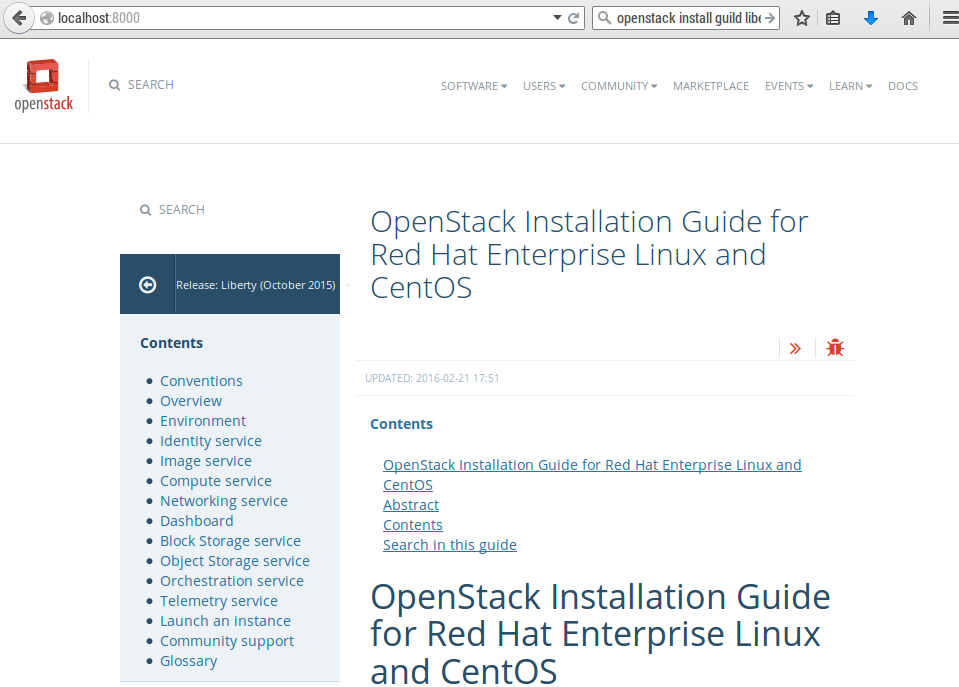

บทที่ 3 ติดตั้ง Openstack
#########################

3.1 เตรียมพร้อมเอกสาร
*********************

.. code-block:: bash
    :linenos:

    pip install tox
    git clone https://github.com/openstack/openstack-manuals
    cd openstack-manuals
    tox -e docs
    ls doc
    admin-guide-cloud  arch-design-draft  common            contributor-guide  image-guide    networking-guide  user-guide
    arch-design        cli-reference      config-reference  glossary           install-guide  pom.xml           user-guide-admin

    cd doc/install-guide/build-rdo/htmldoc/install-guide/build-rdo/html
    python -m SimpleHTTPServer

เปิด brower ไปยัง port 8000

3.2 ติดตั้ง Openstack ด้วย RDO (Single Node allinone)
*****************************************************

สร้าง Project Folder

.. code-block:: bash
    :linenos:

    mkdir ~/Vagrant
    cd ~/Vagrant
    touch Vagrantfile

Vagrantfile

.. code-block:: bash
    :linenos:

    # -*- mode: ruby -*-
    # vi: set ft=ruby :

    Vagrant.configure(2) do |config|
      config.vm.box = "centos/7"
      config.vm.define :rdo do |c|
        c.vm.hostname =  "rdo.example.com"
        c.vm.provider :libvirt do |d|
            d.memory = 4096
            d.cpus = 2
            d.nested = true
        end
      end
     end

vagrant up

.. code-block:: bash
    :linenos:

    vagrant plugin install vagrant-libvirt
    vagrant up --provider libvirt
    vagrant ssh
    sudo su -

vagrant user มีสิทธิ sudo และ มี password  vagrant หากไม่การกำหนด private network จะทำให้
vm ที่สร้างขึ้นมานั้นจะได้รับค่าเป็น Default network เสมอ และนอกจากนั้น vagrant จะทำการ mount
file system ภายในและภายนอก ``Rsyncing folder: /home/admin/Vagrant/rdo/ => /home/vagrant/sync``

ตั้งค่า selinux ให้เป็น permissive

.. code-block:: bash
    :linenos:

    yum install vim
    setenforce 0
    vim /etc/sysconfig/selinux

    SELINUX=permissive

กำหนดให้ใช้ network แทน NetworkManager

.. code-block:: bash
    :linenos:

    systemctl start network
    systemctl enable network
    systemctl stop NetworkManager
    systemctl disable NetworkManager

ติดตั้ง Repo

.. code-block:: bash
    :linenos:

    yum install -y epel-release
    yum install -y https://www.rdoproject.org/repos/rdo-release.rpm-y https://www.rdoproject.org/repos/rdo-release.rpm
    yum install openstack-packstack

    packstack --gen-answer-file  packstack-answerfile.txt

    packstack --answer-file packstack-answerfile.txt

การปรับแต่ค่าใน answerfile จะใช้คำสั่ง ``grep -n  [keyword] file`` เพื่อสะดวกในการดึงข้อมูล
และใช้ ``vim  file +[หมายเลขบรรทัด]`` เพื่อให้ vim เปิด file ตามที่ต้องการ

.. code-block:: bash
    :linenos:

    wc -l packstack-answerfile.txt
    grep -n INSTALL packstack-answerfile.txt
    grep -n HOST packstack-answerfile.txt
    grep -n CINDER packstack-answerfile.txt
    grep -n HEAT packstack-answerfile.txt
    grep -n NTP packstack-answerfile.txt

.. note::
    NTP ใช้
      - 3.th.pool.ntp.org3.th.pool.ntp.org
      - 0.asia.pool.ntp.org0.asia.pool.ntp.org
      - 2.asia.pool.ntp.org2.asia.pool.ntp.org

**หัวใจสำคัญคือ puppet module**

3.3 ติดตั้ง Openstack ด้วย RDO Multinode
****************************************

่ทดสอบด้วยการสร้าง ด้วย rdo ก่อนจะทำบนเครื่องจริง โดย มีarchitecture

.. image:: /_images/vagrant-setup.png

สร้างระบบด้วย vagrant file ด้วยการสร้าง ไฟล์ ชื่อ Vagrantfile และ password.sh

.. code-block:: bash
    :linenos:

    mkdir project
    cd project
    touch Vagrantfile

เนื้อหาใน Vagrantfile เป็นการสร้าง node ขึ้นมาจำนวน 3 โหนด คือ controller, compute1, network

.. code-block:: bash
    :linenos:

    # -*- mode: ruby -*-
    # vi: set ft=ruby :
    MGN_NETWORK="10.0.0"
    TUNNEL_NETWORK="10.0.1"
    EXTERNAL_NETWORK="203.0.113"

    Vagrant.configure(2) do |config|
      config.vm.box = "centos/7"
      # controller vm
      config.vm.define :controller do |c|
          c.vm.hostname =  "controller.example.com"
          c.vm.provider :libvirt do |d|
                  d.memory = 1024
                  d.cpus = 1
                  d.nested = true
          end
          c.vm.synced_folder ".", "/vagrant", type: "rsync"
          #eth1,  API NETWORK will be the management endpoint
          c.vm.network :private_network, ip: "#{MGN_NETWORK}.11", netmask: "255.255.255.0"

          # yum update
          c.vm.provision "shell", inline: <<-EOF
          source /vagrant/password.sh
          echo root:stack | chpasswd
          yum -y install epel-release
          yum -y install http://rdo.fedorapeople.org/openstack-kilo/rdo-release-kilo.rpm
          yum -y install openstack-selinux

          cat  <<- HOST  >> /etc/hosts
          10.0.0.11  controller.example.com controller
          10.0.0.21  network.example.com network
          10.0.0.31  compute1.example.com compute1
          HOST
          EOF

      end
      #network vm
      config.vm.define :network do |c|
          c.vm.hostname =  "network.example.com"
          c.vm.provider :libvirt do |d|
                  d.memory = 1024
                  d.cpus = 1
                  d.nested = true
          end

          c.vm.synced_folder ".", "/vagrant", type: "rsync"
          #eth1,  API NETWORK will be the management endpoint
          c.vm.network :private_network, ip: "#{MGN_NETWORK}.21", netmask: "255.255.255.0"

          #eth2,  API NETWORK will be the management endpoint
          c.vm.network :private_network, ip: "#{TUNNEL_NETWORK}.21", netmask: "255.255.255.0"

          #eth3,  API NETWORK will be the management endpoint
          c.vm.network :private_network, ip: "#{EXTERNAL_NETWORK}.21", netmask: "255.255.255.0"

          # yum update
          c.vm.provision "shell", inline: <<-EOF
          source /vagrant/password.sh
          echo root:stack | chpasswd
          yum -y install epel-release
          yum -y install http://rdo.fedorapeople.org/openstack-kilo/rdo-release-kilo.rpm
          yum -y install openstack-selinux

          cat  <<- HOST  >> /etc/hosts
          10.0.0.11  controller.example.com controller
          10.0.0.21  network.example.com network
          10.0.0.31  compute1.example.com compute1
          HOST
          EOF
      end
      #compute1 vm
      config.vm.define :compute1 do |c|
          c.vm.hostname =  "compute1.example.com"
          c.vm.provider :libvirt do |d|
                  d.memory = 1024
                  d.cpus = 1
                  d.nested = true
          end

          c.vm.synced_folder ".", "/vagrant", type: "rsync"
          #eth1,  API NETWORK will be the management endpoint
          c.vm.network :private_network, ip: "#{MGN_NETWORK}.31", netmask: "255.255.255.0"

          #eth2,  API NETWORK will be the management endpoint
          c.vm.network :private_network, ip: "#{TUNNEL_NETWORK}.31", netmask: "255.255.255.0"

          # yum update
          c.vm.provision "shell", inline: <<-EOF
          source /vagrant/password.sh
          echo root:stack | chpasswd
          yum -y install epel-release
          yum -y install http://rdo.fedorapeople.org/openstack-kilo/rdo-release-kilo.rpm
          yum -y install openstack-selinux
          cat  <<- HOST  >> /etc/hosts
          10.0.0.11  controller.example.com controller
          10.0.0.21  network.example.com network
          10.0.0.31  compute1.example.com compute1
          HOST
          EOF
      end
    end
